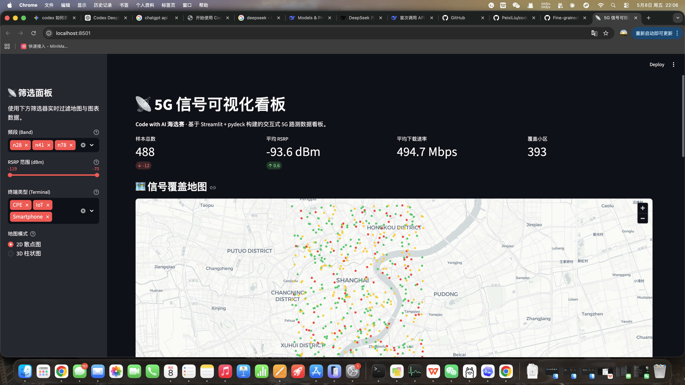
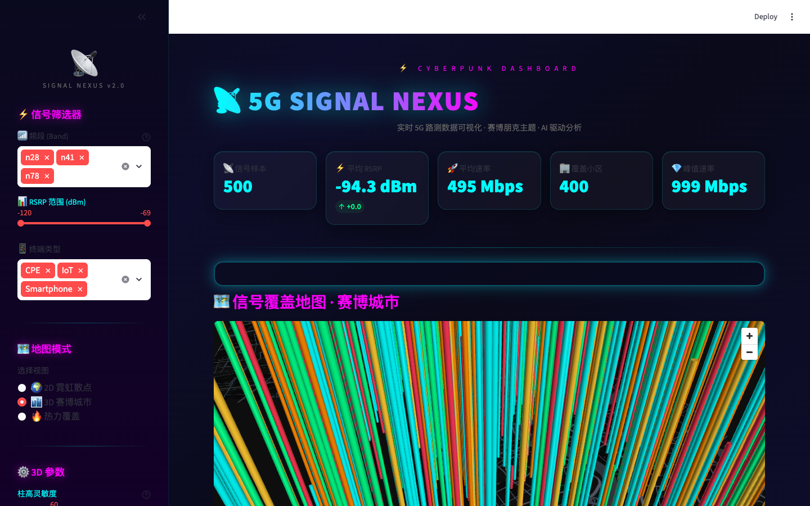
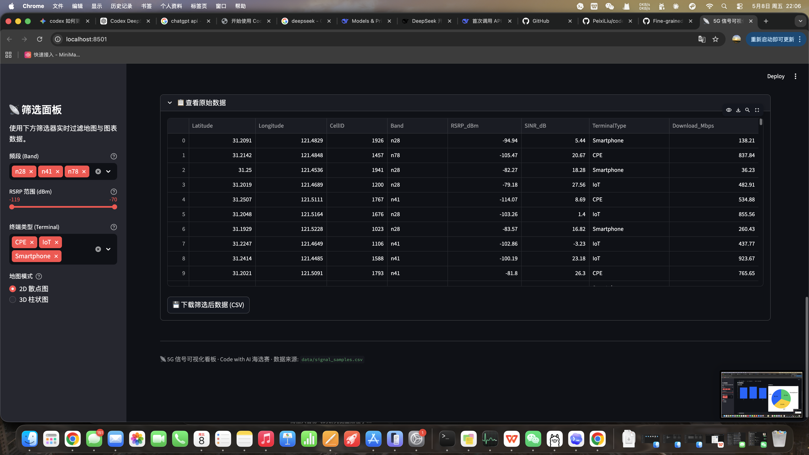

# 📡 5G 信号可视化看板

> **Code with AI 海选赛** — 基于 Streamlit + pydeck 构建的交互式 5G 路测数据可视化仪表板

## 功能概览

### 🟢 基础关卡

| 功能 | 说明 |
|------|------|
| **数据加载** | 使用 pandas 读取 `data/signal_samples.csv` 中的 500 条 5G 路测数据 |
| **信号散点地图** | 2D 交互地图，信号点根据 RSRP 值自动变色（绿 > -90dBm > 黄 > -110dBm > 红） |
| **数据概览图表** | 各频段基站数量柱状图 + 各终端类型占比饼图 |

### 🟡 进阶关卡

| 功能 | 说明 |
|------|------|
| **侧边栏联动筛选** | 频段多选、RSRP 范围滑动条、终端类型多选 — 地图和图表实时响应 |
| **3D 地图** | pydeck ColumnLayer 渲染 3D 柱状图，柱高随下载速率变化，颜色按信号强度编码 |
| **工程化素养** | 规范注释 + 完整单元测试（数据加载、颜色映射、筛选逻辑、数据完整性） |

## 运行方法

### 方式一：pip 安装依赖

```bash
# 安装依赖
pip install -r requirements.txt

# 启动看板
streamlit run app.py
```

### 方式二：使用 uv（推荐，速度更快）

```bash
# 安装 uv（若未安装）
curl -LsSf https://astral.sh/uv/install.sh | sh

# 运行
uv run streamlit run app.py
```

浏览器会自动打开 `http://localhost:8501`。

## 数据说明

`data/signal_samples.csv` 包含 500 条上海地区的 5G 模拟路测数据：

| 字段 | 说明 | 范围 |
|------|------|------|
| Latitude | 纬度 | 31.18°N ~ 31.28°N |
| Longitude | 经度 | 121.42°E ~ 121.52°E |
| CellID | 小区 ID | 400 个唯一值 |
| Band | 5G 频段 | n28, n41, n78 |
| RSRP_dBm | 参考信号接收功率 | -119.9 ~ -70.0 dBm |
| SINR_dB | 信噪比 | -5.0 ~ 29.9 dB |
| TerminalType | 终端类型 | Smartphone, CPE, IoT |
| Download_Mbps | 下行速率 | 13.1 ~ 998.8 Mbps |

## 交互方式

1. **左侧筛选面板**：选择频段、拖动 RSRP 范围、选择终端类型，所有图表实时联动
2. **右上角地图模式**：切换 2D 散点图 / 3D 柱状图
3. **鼠标悬停**：查看每个信号点的详细信息（小区 ID、频段、RSRP、SINR、下载速率）
4. **3D 模式**：拖拽旋转视角，从任意角度观察信号覆盖

## 运行截图

> 📸 截图存放于 `screenshots/` 目录（或见下方说明）

### 2D 散点地图 + 数据概览



### 3D 柱状图



### 侧边栏联动筛选



## 运行测试

```bash
python -m pytest tests/ -v
# 或
python -m unittest tests/test_app.py -v
```

## 项目结构

```
code-with-ai-contest/
├── app.py                  # 主程序 — Streamlit 看板
├── requirements.txt        # Python 依赖
├── README.md               # 项目说明文档
├── AI_PROMPTS.md           # AI 交互记录（本题核心交付物）
├── data/
│   └── signal_samples.csv  # 5G 路测数据集
├── tests/
│   ├── __init__.py
│   └── test_app.py         # 单元测试
└── screenshots/
    ├── dashboard_2d.png
    ├── dashboard_3d.png
    └── sidebar_filters.png
```

## 技术栈

- **Streamlit** — Web 应用框架
- **pandas** — 数据处理
- **pydeck** — 2D/3D 地图可视化
- **matplotlib** — 饼图绘制
- **unittest** — 单元测试

## 作者

由 AI Coding Agent (OpenClaw) 使用 Claude 4 (DeepSeek 后端) 构建，
遵循 **"Code with AI"** 比赛精神 — 不手动写代码，全部通过 AI 会话驱动。
